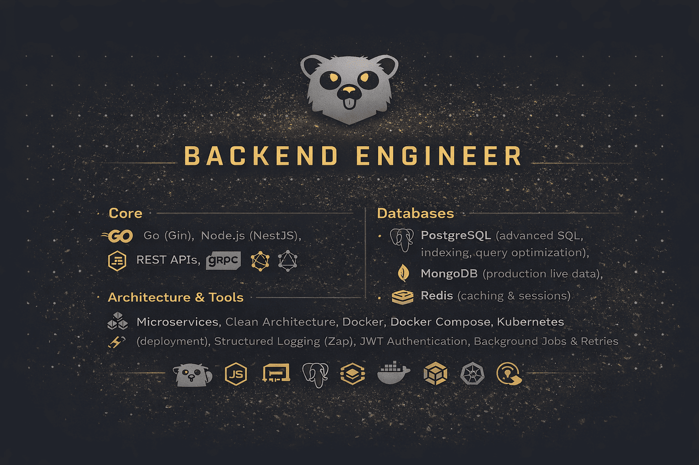
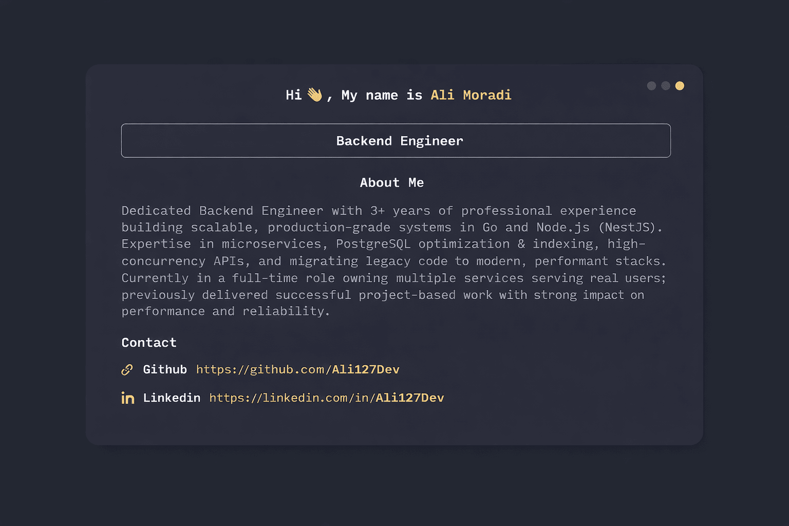

## Hi there 👋, I'm Ali Moradi!

> Building reliable backend systems that scale with confidence. I work on production-grade services where performance, maintainability, and clarity matter. My focus is on writing backend code that survives growth — not just launch. From database optimization to service design, I aim to deliver systems that are predictable, efficient, and easy to extend.

## I specialize in

- ⚡ High-concurrency APIs
- 🧠 Microservices architecture
- 🗄 Advanced PostgreSQL optimization & indexing
- 🚀 Migrating legacy systems to modern, performant stacks
- 🔐 Secure authentication (JWT) & background job processing

---

---

## Tech Stack

