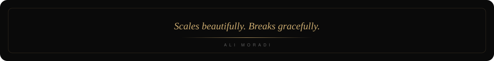

<div align="center">



<br/><br/>

<a href="https://linkedin.com/in/ali127dev"></a>
<a href="mailto:ali127dev@gmail.com"></a>

</div>

<br/>

<h3 align="center">A B O U T</h3>

```go
var ali = Engineer{
    Role:     "Backend Engineer",
    Stack:    []string{"Go", "TypeScript", "PostgreSQL", "NATS", "Kafka"},
    Focus:    []string{"Distributed Systems", "Event-Driven Architecture", "Production Reliability"},
    Building: []string{"TrueFlow — HR platform, DDD + Hexagonal", "Go microservices @ Qbify"},
    Believes: "Design for failure, not for the demo.",
}
```

<br/>

<h3 align="center">H O W &nbsp; I &nbsp; B U I L D</h3>



<br/>

<h3 align="center">O P E N &nbsp; S O U R C E</h3>

<table>
<tr>
<td width="50%" valign="top">

#### [`xoutbox`](https://github.com/Ali127Dev/xoutbox)


Broker-agnostic **Transactional Outbox** for Go. Guaranteed delivery and zero dual-write drift, with pluggable adapters for Kafka, NATS & RabbitMQ.

</td>
<td width="50%" valign="top">

#### [`xerr`](https://github.com/Ali127Dev/xerr)


**Structured error handling** for Go services. Errors are typed, contextual, and traceable, and the library runs in production at Qbify.

</td>
</tr>
</table>

<br/>

<h3 align="center">A R S E N A L</h3>

<div align="center">


<br/>


</div>

<br/>


